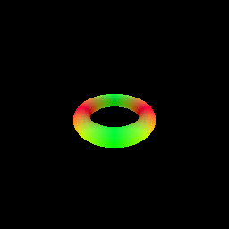
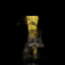

Assignment 4
===================================

Andrew ID: rohanaga

Late Days: 2


##  1. Sphere Tracing

```
python -m NeuralSurfaceRendering.main --config-name=torus
```

 | |
|---|


Implementation: 
---
1. Initialize points at the origin
2. For max_iters=64 iterations:
   1. Compute signed distance function for every point
   2. Move each point along its respective ray by a distance equal to its signed distance function
3. Mark points within eps (= 1e-5) distance of a surface as a surface point using a binary mask and rest of the points as background


##  2. Optimizing a Neural SDF   

```bash
python -m NeuralSurfaceRendering.main --config-name=points
```

|input                              | surface rendering                      |
|-----------------------------------|----------------------------------------|
|  |  |


Implementation:
----

MLP: 
- Similar architecture as used for the NeRF implementation with the exception of removing the ReLU activation 
in the last FC layer of the distance prediction network to allow the output to assume negative values. 
- MLPWithSkips network with a skip connection at layer 3.
- Position embedding (using Harmonic Embedding) to help render high frequency detail better.
- Xavier initialization for all layers.

Losses:
- Eikonal Loss: I used `|Norm(gradient) - 1)|` as the eikonal loss at a point. The final loss is computed as the mean of eikonal loss over 
  randomly sampled points.
- Point Cloud SDF Loss: `norm(sdf(points))` normalized by the number of points to enforce zeros sdf at the points in the point clouds.
- The term `exp(-1e2 * |eikonal_distances|)` with mean reduction helps prevent the network from learning a degenerate solution of all zero distances.

##  3. VolSDF

```bash
python -m NeuralSurfaceRendering.main --config-name=volsdf
```

| beta           | VolSDF Geometry                                                         | VolSDF Color                                         |
|-------------|------------------------------------------------------------------|------------------------------------------------------|
| 0.05 |  |  |
| 0.5  |            |         |
| 1    |      |           |


Implementation:
---

MLP: 
- Similar architecture as NeRF used for colour prediction i.e. 2(cfg.n_layers_color) FC layers followed by a final output layer.
- ReLU activation in the first 2 FC layers and Sigmoid in the final layer
- Xavier initialization for all layers.

SDF to Density: 

- **Beta:** Controls how smooth is the density transition across the surface boundary. A low beta results in a sharper transition and a high beta in a 
  smoother 
  transition


- **Alpha:** Determines the constant density scale for all points


**1. How does high `beta` bias your learned SDF? What about low `beta`?**
   
 A high beta causes a smoother density roll-off at the surface boundary. Consequently, the object boundaries can appear blurry and 
    high frequency detail might not render correctly. A low beta value, on the other hand results in the network learning sharper boundaries
    at the surface. 

**2. Would an SDF be easier to train with volume rendering and low `beta` or high `beta`? Why?**
    
It might be more difficult to train with a low beta as it leads to a sharp transition in density at the surface and therefore
    higher gradients. This is because as beta approaches zero the density variation with signed distance forms a step function. 
    However with a higher beta, although the gradients might be more suitable for training, the density function might not be reflective
    of the true density variation at the surface and make the rendering blurry (and ultimately disappears at beta = 1)

**3. Would you be more likely to learn an accurate surface with high `beta` or low `beta`? Why?**
    
I believe a lower beta helps learn a more accurate and sharper surface boundary. As beta approaches zero, 
    the transparency approaches a high value 
    outside the surface and transitions sharply to a low value near the surface. This provides a more intuitive model of surface geometry as the 
    zero level set of the sdf. With higher values, the geometry renderings are far from from ideal and more discontinuous.

## 4. Neural Surface Extras (CHOOSE ONE! More than one is extra credit)


### 4.2 Fewer Training Views 


```bash
python -m NeuralSurfaceRendering.main --config-name=volsdf_sparse
python -m NeuralRadianceFields.main --config-name=nerf_lego_no_view_sparse
```
|         no. of views           |VolSDF geometry| VolSDF color                                             | NeRF color                                              |
|--------------------|---|------------------------------------------------------|-----------------------------------------------------|
| 5   ||  |  |
| 20  ||          |    |
| 100 ||                 |    |

While NeRF can produce sharper and more accurate rendering with dense views (100 in this case) and comparable results at 20 views, it
significantly underperforms when views are too sparse (5 in this case). Surface rendering does a decent job even with lesser
number of views, albeit with reduced quality. NeRF on the other hand has obvious artifacts in the form of unnatural reflections and
cloudy rendering. 

### 4.3 Alternate SDF to Density Conversions

```bash
python -m NeuralSurfaceRendering.main --config-name=volsdf
```

|       s             |Geometry| Color |
|--------------------|---|------------------------------------------------------|
|5|  ||
| 50 |||
|100|  ||


I implemented the naive distance to sdf function used in the NeUS paper. I varied `s` hyperparameter which governs the 
sharpness of the surface boundary. A higher value results in more accurate rendering because a higher s corresponds to a higher density at the 
surface and lower s to a smoother density roll-off about the surface. 